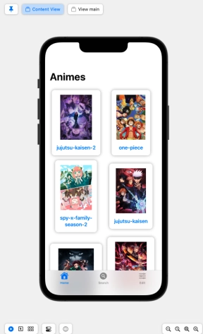
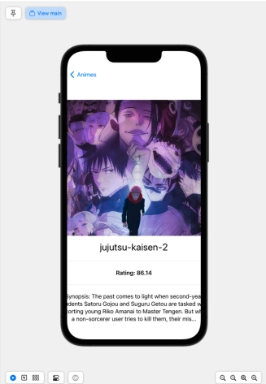
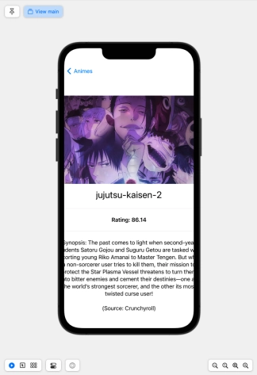

# 411_IOS 📱
Currently, it is very difficult to see when and where a given Anime is streaming in the US. Some shows have different dates, times and platforms even if they are casting during the same season. 
 
What is the solution?

Our solution is to create a mobile app that has nearly all the new anime series’ for a given season in one app. This way, users can search or go through the app to find the anime they are looking for with its streaming service, release time and synopsis. 

## Install
1) Install Swift 🐦
2) Install Xcode (if not already installed) 
3) Install [SF Symbols](https://developer.apple.com/sf-symbols/)

## Home 

## Anime detail view

